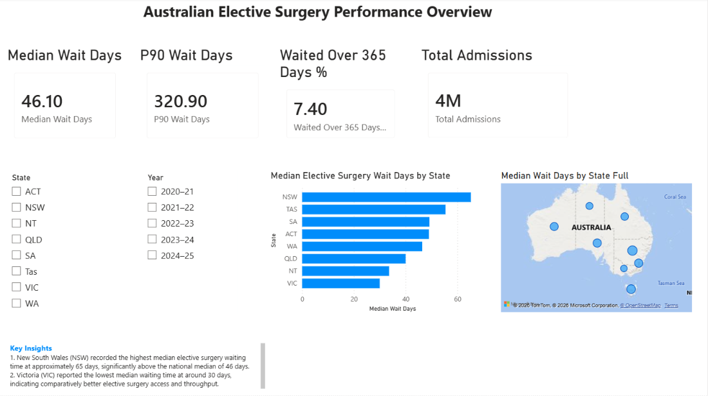
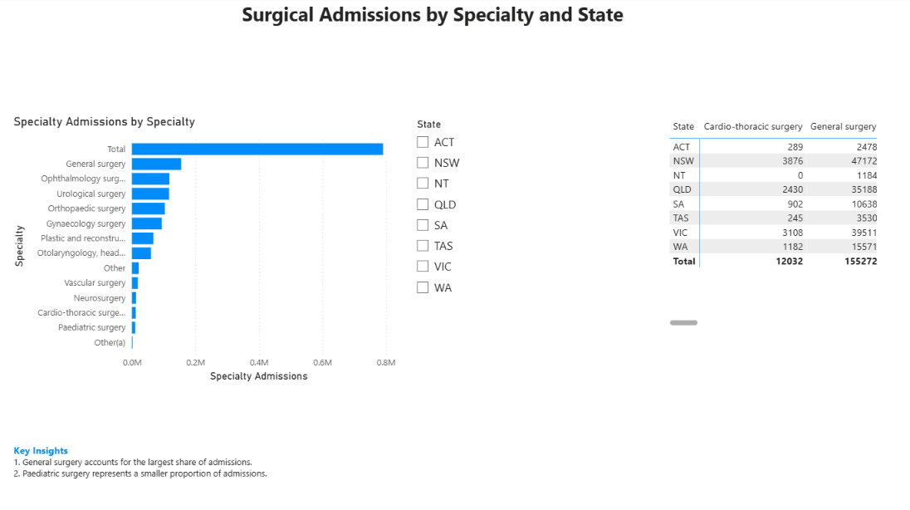
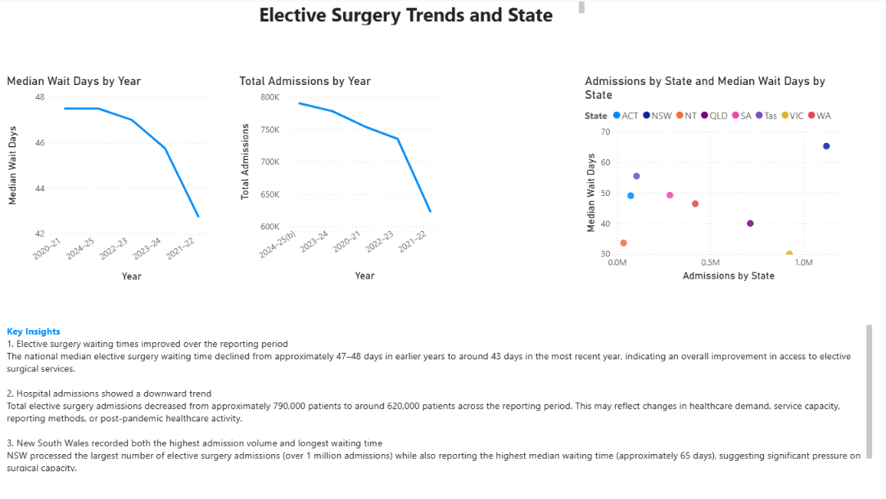

# Australian Healthcare Performance Dashboard

## 📌 Project Overview

This project analyses elective surgery waiting times and hospital admissions across Australian states and territories using publicly available healthcare data from the Australian Institute of Health and Welfare (AIHW).

The dashboard was built in Power BI to compare state-level healthcare performance, identify waiting time trends, analyse surgical demand, and benchmark elective surgery performance across Australia.

---

## 🎯 Project Objectives

- Analyse elective surgery waiting times across Australian states and territories
- Compare hospital admissions and surgical demand by state
- Identify changes in waiting times from 2020–21 to 2024–25
- Benchmark states based on admission volume and median waiting time
- Demonstrate Power BI, Power Query, DAX, and healthcare analytics skills

---

## 🛠 Tools & Technologies

- Power BI
- Power Query
- DAX
- Microsoft Excel
- Data Modelling
- Data Visualisation
- Healthcare Analytics

---

## 📂 Dataset

**Source:** Australian Institute of Health and Welfare (AIHW)

Datasets used:

- Table 2.4 – Elective Surgery Admissions
- Table 3.2 – Surgical Specialties
- Table 4.1 – Historical Trends
- Table 4.2 – State Waiting Times

Reporting period:

- 2020–21 to 2024–25

---

## 📊 Dashboard Pages

### 1. National Overview

This page provides a high-level view of elective surgery performance across Australia.

Key metrics include:

- Median Wait Days
- 90th Percentile Wait Days
- Percentage Waiting More Than 365 Days
- Total Admissions

---

### 2. Surgical Analysis

This page analyses surgical admissions by specialty and state.

It helps identify which surgical categories have the highest demand across Australia.

---

### 3. Trends & Benchmarking

This page tracks elective surgery trends over time and compares state-level performance using admissions and median waiting days.

---

## 📈 Key Insights

- New South Wales recorded the highest median elective surgery waiting time.
- Victoria maintained comparatively lower waiting times despite high admission volumes.
- National median waiting times improved across the reporting period.
- Around 7.4% of patients waited longer than 365 days for elective surgery.
- Admission volume alone does not fully explain waiting time performance.
- State-level variation suggests differences in capacity management and healthcare service efficiency.

---

